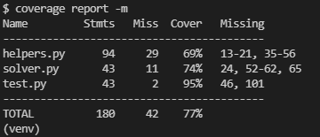
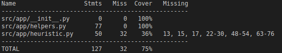
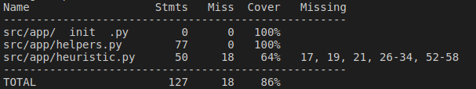

# Testausdokumentti

Testeissä ei toistaiseksi testata koko pelin toimivuutta.

## Testien ajaminen

Testit voidaan ajaa repositorion juuressa, kun riippuvuudet on asennettu komennolla

    coverage run -m unittest discover src/test

Testikattavuusraportin pystyy generoimaan komennolla

    coverage report -m --omit=src/test/*

Sovelluksesta testataan tällä hetkellä kaikki apufunktiot helpers.py tiedostosta. Heuristiikoista testataan MD ja LC+MD. Itse algoritmia ei testata, sillä se saattaa antaa erillaisen lyhimmän polun pelille riippuen mitä heuristiikkaa käyttää. Hyvä testaus käytänne algoritmin testaamiseen on, mikäli vertaillessa huomaa, että kahdella eri heuristiikalla saadaan jostain syystä eri määrä siirtoja samalle pelille, on tällöin vika joko IDA*:ssa tai siinä heuristiikassa, jonka antaa suuremman määrän siirtoja.

Ohjelmasta jätetään testaamatta Euclid distance ja Misplaced distance heuristiikat, sillä niillä ei ole muutenkaan tarkoitusta voida ratkaista peliä tehokkaasti, ne on vain lisätty muuten vain ohjelmaan.

## Testikattavuus - 25.9.2021

## Testikattavuus - 2.10.2021

## Testikattavuus - 9.10.2021

