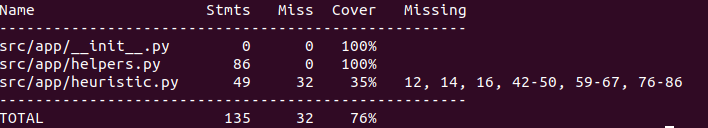
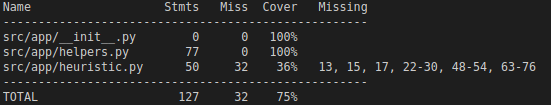

# Testausdokumentti

Testeissä ei toistaiseksi testata koko pelin toimivuutta.

## Testien ajaminen

Testit voidaan ajaa repositorion juuressa, kun riippuvuudet on asennettu komennolla

    coverage run -m unittest discover src/test

Testikattavuusraportin pystyy generoimaan komennolla

    coverage report -m --omit=src/test/*

Tällä hetkellä sovelluksesta testataan kaikki apufunktiot ja Manhattan etäisyyden laskeminen. Sovelluksessa ei toistaiseksi testata tuottaako peli milläkin heuristiikalla oikean ratkaisun. Lisäksi kaikkia heuristiikoita ei vielä testata, sillä ne ovat osin vielä kehityksen alla.

## Testikattavuus - 25.9.2021

## Testikattavuus - 2.9.2021

