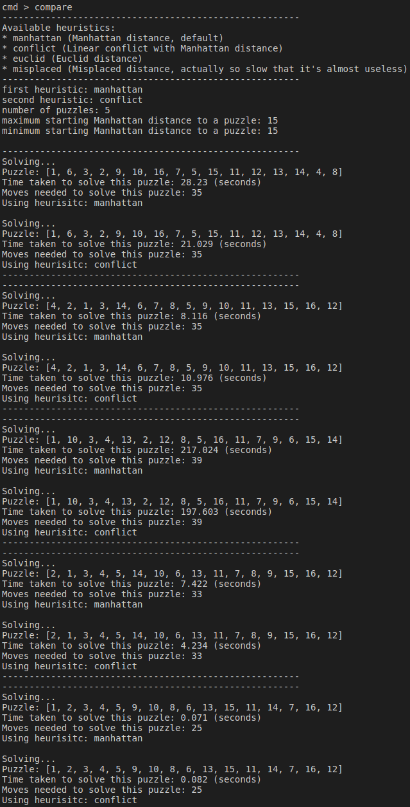
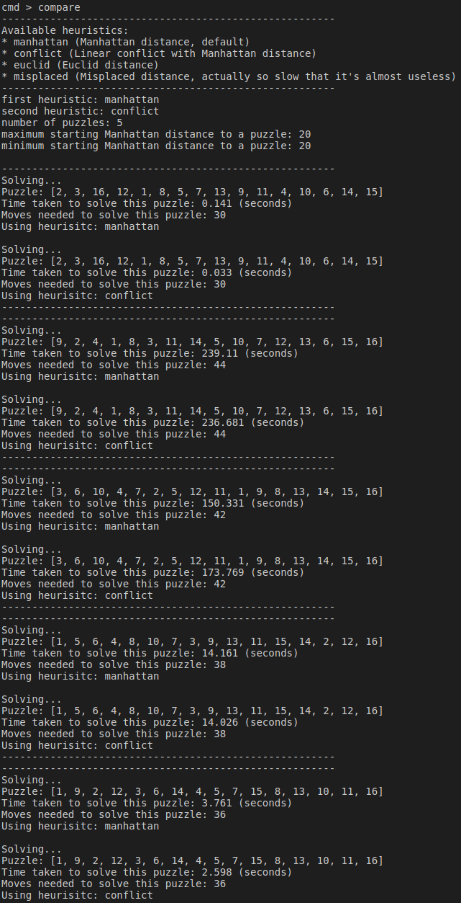
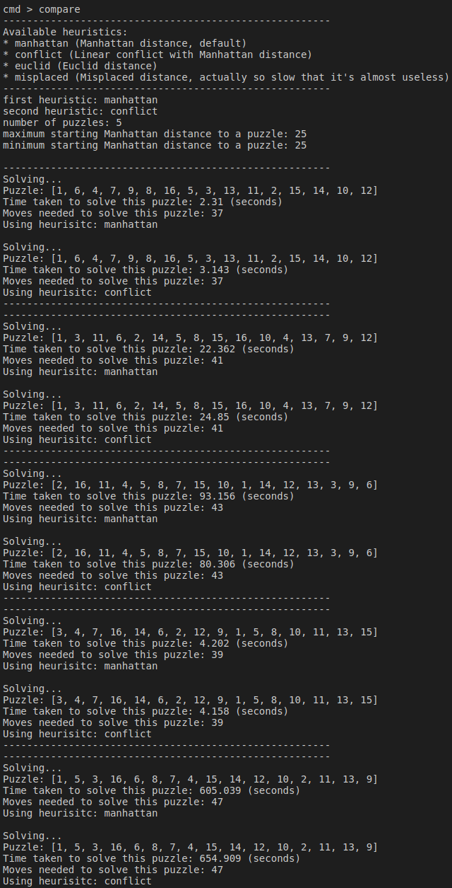

# Toteutusdokumentti

## Toteutus

Sovellus on toteutettu käyttämällä IDA* algoritmia ja käytössä on tällä hetkellä 4 heuristiikkaa:
* Misplaced distance
* Euclidic distance
* Manhattan distance
* Linear conflict

Kaksi ensimmäistä heuristiikkaa toimii hyvin hitaasti helpoillekkin peleille, mutta ne on lähinnä lisätty sovellukseen varmistamaan IDA*:n toimivuutta, jossa ilmeni kehityksen aikana puutteita. Nyt kun IDA* (oletettavasti) on korjattu on sovellus erittäin hidas ratkaisemaan peliä, mikäli se on vähänkin liian vaativa millä tahansa yllä listatulla heuristiikalla.

Sovelluksesta on luotu hyvin yksinkertainen C++ tynkäversio ratkaisemaan peliä Manhattan etäisyydellä oman C++ osaamiseni rajoissa. Tarkoitukseni oli hieman testata, että onko python todellakin niin hidas ratkaisemaan peliä, mutta osoittautuikin, että sovelluksen python versio on C++ versiota jonkun verran nopeampi.

## Suorituskykyvertailua

Alla olevissa kuvissa on suorituskyky vertailu heuristiikkojen Manhattan etäisyys ja Linear Conflict välillä. Kuvista voidaan huomata, että linear conflict heuristiikan osalta jokin on pielessä, nimittäin rivin viimeinen luku listan vieressä kertoo ratkaisuun vaadittujen siirtojen lukumäärän. Siirtojen lukumäärä on Linear Conflict heuristiikan osalta välillä liian suuri. Oletan, että IDA* toimii kuten sen pitää, sillä jokaisella testiyrittämällä nykyisen manhattanin antama siirtojen lukumäärä on kaikista heuristiikoista ollut aina pienin. Alla olevat tapaukset ovat melko yksinkertaisia, sillä ne on generoitu olettaen Manhattan etäisyyden olevan maksimissaan 15 kyseisen pelin lähtötilanteelle. Pelin tehokkuudessa on siis pulaa ja vain Manhattan etäisyyden tiedän toimivan oikein.

Vasemmalla Manhattan etäisyys ja oikealla Linear Conflict.

Lyhenteet heuristiikoille:
* MD = Manhattan distance
* MD+LC = Linear conflict

Alla olevissa kuvissa on suorituskyky vertailua MD ja MD+LC heuristiikkojen välillä. Vasemmalla olevassa kuvassa on suoritettu vertailu olettaen jokaisen ratkaistun pelin aloitustilanteen MD on 15 ja oikealla puolella MD jokaisella pelin alkutilanteella on 20.

Kuvista voidaan huomata, että suorituskyky ratkaista peli on parempi, mitä pienempi lähtötilanteen Manhattan etäisyys on. Ohjelma on siis todella hidas ratkaisemaan peliä satunnaisessa yleisessä tapauksessa, sillä valtaosan peleistä aloitus Manhattan etäisyys on 40 kokoluokkaa. Toisaalta ehdoton yläräja Manhattan etäisyydelle on 80 ja on siis oletettavaa, että tällaisen pelin ratkaisemiseen menee ohjelmalla erittäin paljon aikaa. En ole onnistunut ratkaisemaan yhtään peliä, jossa alkutilanteen MD arvo on suurempaa kuin 50.Lisäksi alkutilanteen MD arvon ollessa suurenpi kuin 25 voidaan huomata selkeä hidastuminen ohjelman toiminnassa. Voidaan siis päätellä, että vain murto-osa peleistä tulee ratkaistuksi järkevässä ajassa. Alla olevassa vasemman puolimmaisimmassa kuvassa on pelit ratkaistuna käyttäen MD arvoa 25 ja oikealla pelit ratkaistu käyttäen MD arvoa 30. Jouduin useamman kerran yrittää generoida oikeanpuolimmaista kuvaa, sillä se jäätyi useampaan otteeseen johonkin peliin. Voidaan huomata, että viimeisen pelin ratkaisuun meni huomattavan paljon aikaa.

## Työn puutteet

Sovelluksen ehdoton puute tällä hetkellä on sen nopeus ratkaista peliä. Tämä voi olla joko puute algoritmin/heuristiikkojen optimoinnissa tai puhtaasti siitä, että python on liian hidas kieli ratkaista tämän tyyppistä ongelmaa. LC+MD tulisi voida ratkaista peli järkevässä ajassa, mutta olen löytänyt tapauksia, joissa pelin ratkaiseminen pitkäksikin aikaa junnaamaan paikalleen. On paljon pelejä joihin en ole saanut kymmenienkään minuuttien aikana ratkaisua.

Eräs parannusehdotus voisi olla käyttää jotain toista tehokkaampaa ohjelmointikieltä ratkaisemaan peli pythonin sijasta, esimerkiksi C++, vaikkakin oma C++ kokeilu ratkaisee pelin hieman hitaammin.

## Lähteet

* https://www.geeksforgeeks.org/check-instance-15-puzzle-solvable/
* [https://en.wikipedia.org/wiki/Iterative_deepening_A*](https://en.wikipedia.org/wiki/Iterative_deepening_A*)
* https://medium.com/@prestonbjensen/solving-the-15-puzzle-e7e60a3d9782
* https://michael.kim/blog/puzzle
