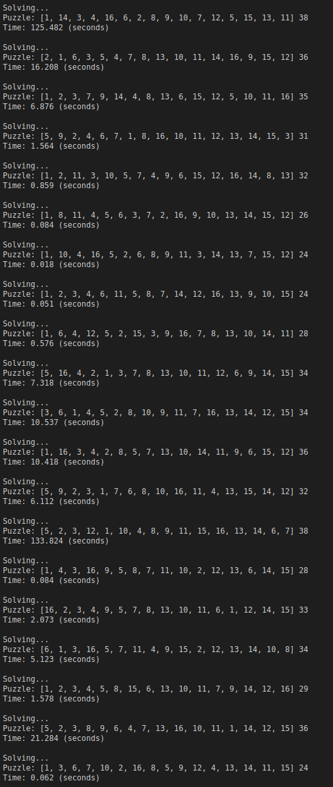
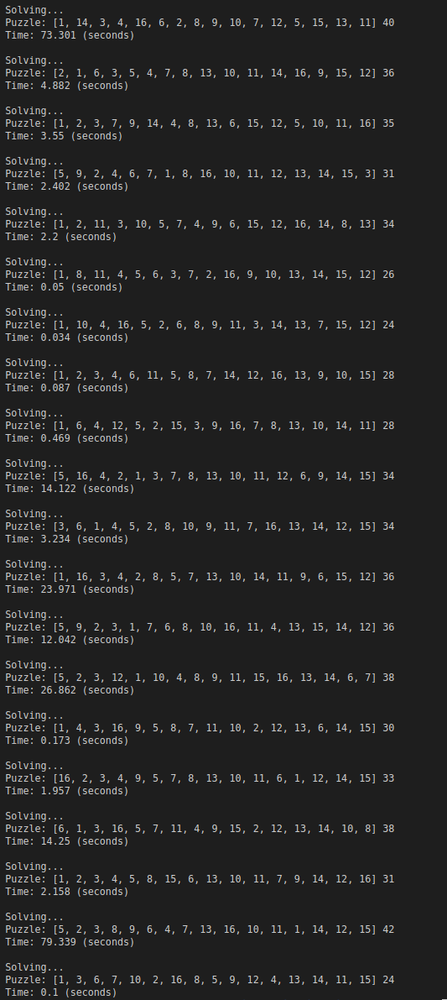

# Toteutusdokumentti

## Toteutus

Sovellus on toteutettu käyttämällä IDA* algoritmia ja käytössä on tällä hetkellä 4 heuristiikkaa:
* Misplaced distance
* Euclidic distance
* Manhattan distance
* Linear conflict

Kaksi ensimmäistä heuristiikkaa toimii hyvin hitaasti helpoillekkin peleille, mutta ne on lähinnä lisätty sovellukseen varmistamaan IDA*:n toimivuutta, jossa ilmeni kehityksen aikana puutteita. Nyt kun IDA* (oletettavasti) on korjattu on sovellus erittäin hidas ratkaisemaan peliä jos se on vähänkin liian vaativa millä tahansa yllä listatulla heuristiikalla.

Sovelluksesta on luotu hyvin yksinkertainen C++ tynkäversio ratkaisemaan peliä Manhattan etäisyydellä oman C++ osaamiseni rajoissa. Tarkoitukseni oli hieman testata, että onko python todellakin niin hidas ratkaisemaan peliä, mutta osoittautuikin, että sovelluksen python versio on C++ versiota jonkun verran nopeampi.

## Suorituskykyvertailua

Alla olevissa kuvissa on suorituskyky vertailu heuristiikkojen Manhattan etäisyys ja Linear Conflict välillä. Kuvista voidaan huomata, että linear conflict heuristiikan osalta jokin on pielessä, nimittäin rivin viimeinen luku listan vieressä kertoo ratkaisuun vaadittujen siirtojen lukumäärän. Siirtojen lukumäärä on Linear Conflict heuristiikan osalta välillä liian suuri. Oletan, että IDA* toimii kuten sen pitää, sillä jokaisella testiyrittämällä nykyisen manhattanin antama siirtojen lukumäärä on kaikista heuristiikoista ollut aina pienin. Alla olevat tapaukset ovat melko yksinkertaisia, sillä ne on generoitu olettaen Manhattan etäisyyden olevan maksimissaan 15 kyseisille peleille. Pelin tehokkuudessa on siis pulaa ja vain yksi heuristiikoista tiedän, että toimii oikein.

## Työn puutteet

Sovelluksen ehdoton puute tällä hetkellä on sen nopeus ratkaista peliä. Tämä voi olla joko puute algoritmin/heuristiikkojen optimoinnissa tai puhtaasti siitä, että python on liian hidas kieli ratkaista tämän tyyppistä ongelmaa. Linear conflict + Manhattan etäisyys tulisi voida ratkaista peli järkevässä ajassa, mutta olen löytänyt tapauksia, joissa pelin ratkaiseminen pitkäksikin aikaa junnaamaan paikalleen. On paljon pelejä joihin en ole saanut kymmenienkään minuuttien aikana ratkaisua.

Eräs parannusehdotus voisi käyttää jotain toista tehokkaampaa ohjelmointikieltä ratkaisemaan peli pythonin sijasta, esimerkiksi C++, vaikkakin oma C++ kokeilu ratkaisee pelin hieman hitaammin.

## Lähteet

* https://www.geeksforgeeks.org/check-instance-15-puzzle-solvable/
* [https://en.wikipedia.org/wiki/Iterative_deepening_A*](https://en.wikipedia.org/wiki/Iterative_deepening_A*)
* https://medium.com/@prestonbjensen/solving-the-15-puzzle-e7e60a3d9782
* https://michael.kim/blog/puzzle
